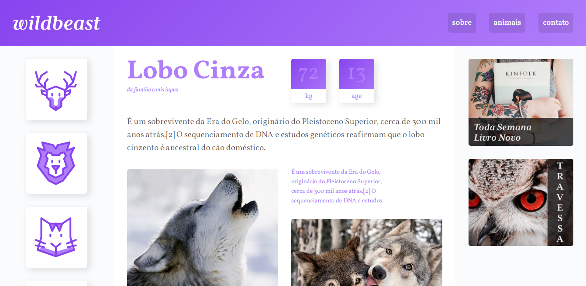
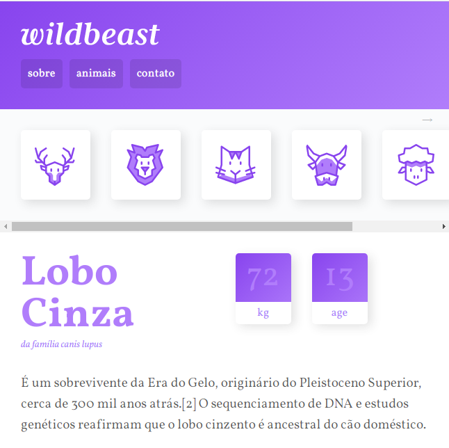

<h1  align="center"></h1>

  A página Wildbeast foi criada com intuito de aplicar os conceitos estudados de CSS Grid. Além disso trata-se de uma página totalmente responsiva.

<h2 id="demonstracao">Demonstração</h2>

  
  

<h2 id="autora">👤 Autor</h2>

<h3>Desenvolvido por Ricardo Nagel com auxílio da Origamid</h3>

* [Linkedin](https://www.linkedin.com/in/ricardonagel/)

  
<strong align="center">Deixe sua ⭐️ se gostou do projeto</strong>

  
